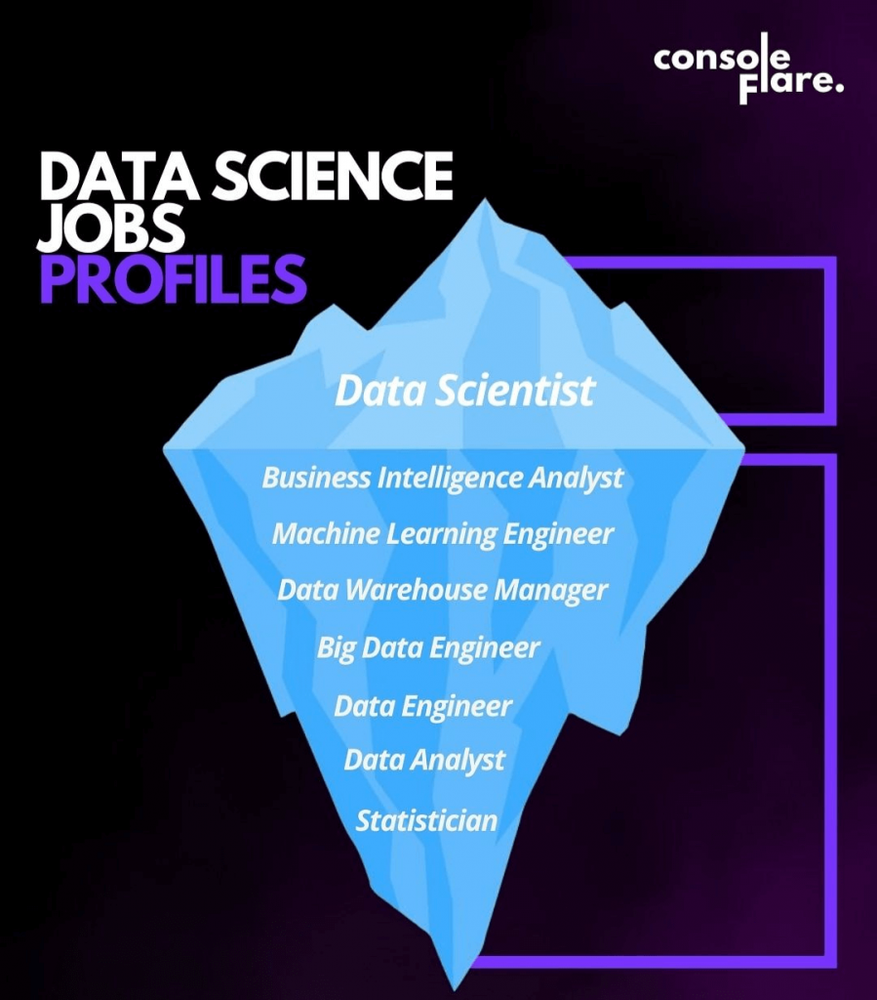

# Australia_Data_Science_Jobs

🔍 Insights
1. Top Locations for Data Science Jobs
Victoria (748 jobs) and New South Wales (695 jobs) lead in job availability.

Together, these two states account for over 69% of all listings, making them prime locations for job seekers.

2. Most In-Demand Skills
Top technical skills required:

SQL (772 mentions)

Python (768 mentions)

R (454 mentions)

Mathematics (441 mentions)

Statistics (353 mentions)

Business intelligence tools like Excel (263) and Tableau (220) are also frequently needed.

3. Salary Overview
Average base salary: AUD 102,876

Salary range: AUD 46,133 – 295,000

75% of jobs offer salaries below AUD 120,000, while the top 25% offer higher.

4. Job Titles & Descriptions
Common titles include: Data Scientist, Data Analyst, Machine Learning Engineer, and Postdoctoral Researcher.

Job descriptions emphasize data cleaning, predictive modeling, machine learning, collaboration, and communication skills.

✅ Recommendations
1. For Job Seekers
Focus your job search in Victoria and NSW for higher chances of landing a role.

Upskill in SQL and Python, as they appear in nearly all job listings.

Gain working knowledge of Tableau, Excel, and cloud platforms (e.g., AWS) to stay competitive.

Highlight soft skills like communication, collaboration, and problem-solving in your resume.

2. For Recruiters & Employers
Consider exploring Queensland and WA for emerging talent pools.

To attract top candidates, clearly state salary ranges and promote flexible work benefits.

Ensure job descriptions align with key tech stacks—avoid redundancy and keep skill expectations reasonable.

3. For Training Institutes or Educators
Offer short-term certification courses in:

SQL & Python for data science

Business intelligence tools (Tableau, Excel)

Applied statistics & ML algorithms

Include modules on soft skills and real-world project experience.
